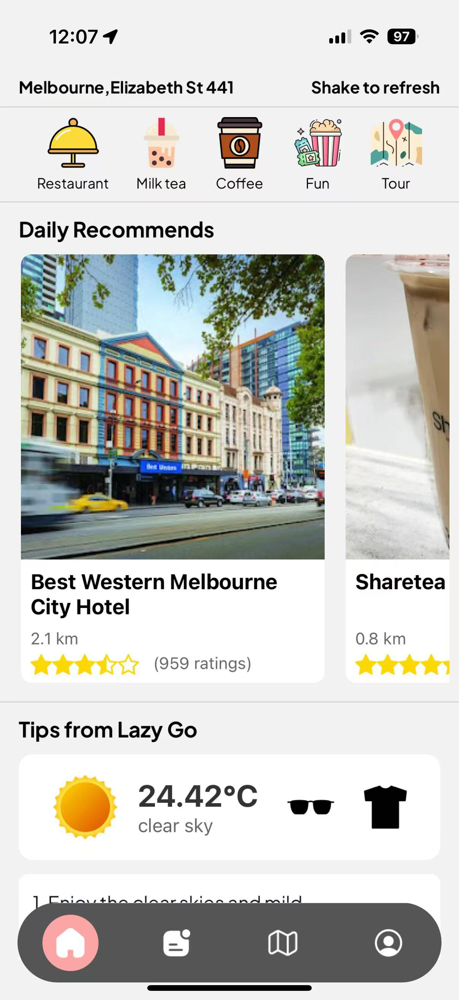
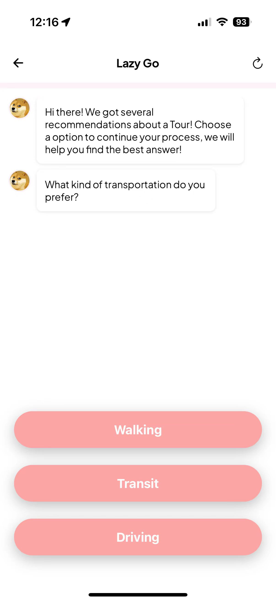

# Welcome to Lazy Go

## Introduction

LazyGo is a mobile app that helps you easily access interesting and valuable locations around you and gives you daily suggestions just for you.


## Generate daily recommend for you

<div style="display: flex; align-items: center;">
  <div style="flex: 1; padding-right: 20px;">
  <h3>
Open the software to quickly find places around you, and you can quickly find them in google maps and bookmark them in your favourites.</h3>  </div>
  <div style="flex: 1;">
    
  </div>
</div>

## Generate custom plans

### By answering a few simple questions can help you find interesting locations that match your preferences!

<div style="display: flex; justify-content: space-between; gap: 10px;">
  
  
  
</div>

### More intresting feature, look at this video for more introduction!

[LazyGo: Discover your surroundings the lazy(easy) way!](https://www.youtube.com/watch?v=qvHTNx8yShg)

## Code structure:

- app: Store all app pages design.
  - (api) store server action api
  - (auth) store authtication pages and instruction pages
  - (root) store the main pages
    - (generate-plan) Store pages about plan generation.
    - (tabs) Store pages in the main page.
- assets: Store pictures and icons
- components: Store reuseable components, functions.
- constants: Store constants.
- lib: Store server actions.

## Technique usage

- Code language: typescript
- Framework: expo reac native
- CSS: tailwind
- Authentication: clerk
- Database: Neon + postgres
- AI technique: ChatGPT
  - The activities of the plan is generated step by step, making sure that the start position of each activity is the position of the previous activity.
  - Generate plan based on the following data: `Details of nearby places with specific types or keywords, history of recommendation (prevent the generated plan from remaining unchanged), distances between the current position to nearby places, generated plan (avoid duplicated places in one plan)`.
  - GPT can choose destinations based on the distance, price level, ratings and make a brief plan to the user.

## Get started

1. Install dependencies

   ```bash
   npm install
   ```

2. Create a .env file with content:

   ```bash
   # Need to fill these values by your api keys
   EXPO_PUBLIC_CLERK_PUBLISHABLE_KEY=
   EXPO_PUBLIC_GOOGLE_MAP_API_KEY=
   EXPO_PUBLIC_GPT_KEY=
   EXPO_PUBLIC_DATABASE_URL=
   EXPO_PUBLIC_SERVER_URL=https://lazygo.com/
   EXPO_PUBLIC_WETHER_API_KEY=
   ```

3. Start the app

   ```bash
   # Do add the flag "--go"
   npx expo start --go
   ```

In the output, you'll find options to open the app in a

- [development build](https://docs.expo.dev/develop/development-builds/introduction/)
- [Android emulator](https://docs.expo.dev/workflow/android-studio-emulator/)
- [iOS simulator](https://docs.expo.dev/workflow/ios-simulator/)
- [Expo Go](https://expo.dev/go), a limited sandbox for trying out app development with Expo

You can start developing by editing the files inside the **app** directory. This project uses [file-based routing](https://docs.expo.dev/router/introduction).

if your can not open the app, try

```bash
npx expo install
```

Any additional problem please let us know.
